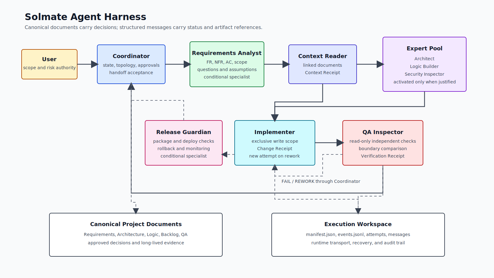

# Agent Harness Architecture
> Created: 2026-07-17 01:04
> Last Updated: 2026-07-17 01:15

## 1. Architecture Goal

The enhanced harness coordinates specialized agents without surrendering user authority, document traceability, implementation scope, or independent verification. It extends the current receipt sequence rather than replacing it.

The architecture is deliberately split into two layers:

1. **Canonical policy layer**: runtime-neutral roles, states, messages, artifacts, gates, and failure rules.
2. **Runtime adapter layer**: Claude Code and Codex mappings to the capabilities actually available in each runtime.

## 2. Design Principles

1. **User authority is non-delegable**: agents may analyze and recommend; unresolved scope, risk, and release decisions return to the user through the Coordinator.
2. **Documents are canonical; messages are transport**: a chat message may announce a result but cannot replace the linked artifact or Receipt.
3. **Minimal topology first**: use a linear four-role path unless a specialist or parallel topology provides a specific benefit.
4. **Persona does not grant permission**: role identity, tool permission, and file ownership are separately declared.
5. **Producer and verifier remain separate**: QA Inspector reports findings and never fixes the implementation it verifies.
6. **Failures are states, not prose**: the Coordinator records a typed state and legal next action.
7. **No silent degradation**: missing critical context, design, code, or verification cannot be hidden by a partial final report.
8. **Adapters are thin**: runtime-specific tool names never become canonical workflow rules.

## 3. System Context And Data Flow



The Coordinator owns the task state. Specialists produce versioned artifacts. The task manifest and event log preserve transport state, while approved project documents remain the source of truth.

## 4. Role Catalog

### 4.1 Core Roles

| Role | Activation | Primary Responsibility | Write Authority |
|---|---|---|---|
| Coordinator | Always | User communication, topology selection, state transitions, approvals, handoffs, completion decision | Backlog, decision and receipt summaries only |
| Context Reader | Code and deploy; advisory elsewhere | Read all linked references, detect conflicts, return Context Receipt | None |
| Implementer | After required design and Context gates pass | Change only approved files and return Change Receipt | Declared implementation ownership |
| QA Inspector | After a Change Receipt; incrementally for complex work | Independently inspect boundaries, execute checks, return findings and Verification Receipt | None, except a separately approved QA report written by Coordinator |

### 4.2 Optional Specialists

| Role | Activation Condition | Required Output | Non-Goal |
|---|---|---|---|
| Requirements Analyst | New feature, ambiguous request, multiple stakeholders, or missing acceptance criteria | User Requirements Analysis | Does not choose unresolved product scope |
| Architect | Cross-module boundary, new API/DB contract, dependency or deployment decision | Architecture Decision Packet | Does not implement the selected design |
| Logic Builder | Non-trivial business rules, state transitions, retry policy, calculation, or authorization logic | Logic Contract | Does not own UI styling or infrastructure |
| Frontend Implementer | UI-specific owned files | Frontend Change Receipt contribution | Does not change backend contracts unilaterally |
| Backend Implementer | API, persistence, authentication, or business-service owned files | Backend Change Receipt contribution | Does not change UI expectations unilaterally |
| Security Inspector | Authentication, authorization, secrets, uploads, PII, or high-risk boundary | Security findings and evidence | Does not replace QA Inspector |
| Release Guardian | Publish, deployment, migration, or rollback risk | Release Readiness Receipt | Does not approve its own unresolved risk |

### 4.3 Activation Rules

- A small single-module change uses the core path only.
- Requirements Analyst is mandatory when acceptance criteria cannot be derived from approved documents.
- Architect is mandatory when a public contract, persistence model, module boundary, dependency, or deployment topology changes.
- Logic Builder is mandatory when more than one state transition, failure branch, invariant, or domain calculation must be coordinated.
- Security Inspector is mandatory for authentication, authorization, secret handling, protected uploads, personal data, or external trust boundaries.
- Release Guardian is mandatory before npm publish, deployment, destructive migration, or rollback-sensitive operations.
- The Coordinator records `Activated` or `Skipped - reason` for every optional role considered.

## 5. Persona Contract

Every runtime agent definition must contain the following fields. Friendly prose may supplement these fields but cannot replace them.

| Field | Purpose |
|---|---|
| `role_id` | Stable machine identifier |
| `mission` | One responsibility stated as an outcome |
| `activation` | Conditions under which the role is invoked |
| `non_goals` | Explicitly excluded decisions and work |
| `required_inputs` | Artifact and Receipt prerequisites |
| `required_outputs` | Schema and canonical destination |
| `allowed_tools` | Minimum tool capability set |
| `denied_tools` | Tools prohibited even if the runtime offers them |
| `write_scope` | Files or directories exclusively owned by the role |
| `communication` | Allowed message types and recipients |
| `escalation` | Conditions that return control to Coordinator or user |
| `completion_criteria` | Evidence required before reporting success |
| `failure_policy` | Retry and non-retry behavior |
| `model_policy` | Task-sensitive capability tier, never a globally fixed model |

## 6. Workflow Topology Selection

| Pattern | Use When | Solmate Constraint |
|---|---|---|
| Linear Pipeline | Default; each output is required by the next stage | Minimal path and default topology |
| Expert Pool | A specialist is conditionally required | Preferred way to activate Architect, Logic Builder, Security, or Release roles |
| Fan-out/Fan-in | Independent read-only searches or test groups can run in parallel | Coordinator integrates results; no overlapping writes |
| Producer-Reviewer | Implementation must be independently assessed | Implementer and QA Inspector remain separate |
| Supervisor | Work volume requires dynamic allocation | Coordinator remains the only approval and state authority |
| Hierarchical Delegation | A large task naturally splits into independently owned domains | Maximum depth two; avoid when a flat team is sufficient |

The Coordinator records the selected pattern, benefit, agent count, write ownership, and fallback before delegation. Two or more agents alone are not sufficient justification for a team topology.

## 7. Canonical Workflow State Machine

### 7.1 Primary States

```text
INTAKE
  -> REQUIREMENTS_READY
  -> CONTEXT_LOCKED
  -> DESIGN_READY
  -> IMPLEMENTING
  -> CHANGE_READY
  -> VERIFYING
  -> COMPLETE
```

`DESIGN_READY` may record Architect and Logic Builder as `Skipped - reason` for a simple task. It does not imply that every task creates extra design documents.

### 7.2 Exception States

| State | Meaning | Legal Next State |
|---|---|---|
| `BLOCKED_CONTEXT` | Required document missing, unread, stale, or conflicting | `CONTEXT_LOCKED` after correction |
| `BLOCKED_DECISION` | User-owned scope, risk, or architecture decision unresolved | Previous state after user decision |
| `BLOCKED_DEPENDENCY` | External service, credential, permission, or environment unavailable | Previous state after dependency recovery |
| `REWORK` | Implementation or evidence failed an accepted criterion | `IMPLEMENTING` with a new attempt |
| `DEGRADED` | Required independent runtime capability unavailable | User-approved continuation or `CANCELLED` |
| `CANCELLED` | User or Coordinator terminates the task | Terminal |

### 7.3 Transition Rules

- Only Coordinator changes the canonical task state.
- Every transition records `from`, `to`, `reason`, `actor`, `timestamp`, and `artifact_refs`.
- `IMPLEMENTING` requires accepted requirements, passing Context Receipt, and any required design outputs.
- `VERIFYING` requires a Change Receipt and a frozen diff or commit reference.
- `COMPLETE` requires a passing Verification Receipt and no unresolved P0/P1 finding.
- PR, merge, publish, and deploy remain downstream gates and may add Release Guardian requirements.
- An illegal transition is a contract failure and is never retried automatically.

## 8. Artifact Model

### 8.1 Canonical Project Documents

| Artifact | Canonical Location | Owner |
|---|---|---|
| User Requirements Analysis | `docs/01_Concept_Design/NN_<FEATURE>_REQUIREMENTS_ANALYSIS.md` | Requirements Analyst, approved by user/Coordinator |
| UI and flow evidence | `docs/02_UI_Screens/` and `previews/` | UI workflow |
| Architecture Decision Packet | `docs/03_Technical_Specs/NN_<FEATURE>_ARCHITECTURE.md` | Architect |
| Logic Contract | `docs/04_Logic_Progress/NN_<FEATURE>_LOGIC.md` | Logic Builder |
| Backlog and receipt summary | `docs/04_Logic_Progress/00_BACKLOG.md` | Coordinator |
| QA plan and detailed evidence | `docs/05_QA_Validation/` | QA process, recorded by Coordinator |

### 8.2 Execution Workspace

```text
_workspace/harness/<task-id>/
├── manifest.json
├── events.jsonl
├── attempt-01/
│   ├── messages/
│   ├── artifacts/
│   └── evidence/
└── attempt-02/
    └── ...
```

Rules:

- `_workspace/` is execution evidence, not the approved product specification.
- Attempts are append-only; a retry creates a new attempt directory.
- `manifest.json` identifies schema version, current state, active attempt, topology, role activation, write ownership, and canonical document links.
- `events.jsonl` records state transitions and message metadata in order.
- Secrets, credentials, raw personal data, and unrestricted production logs are prohibited.
- The project decides whether `_workspace/` is committed, archived, or ignored; canonical evidence links must remain valid either way.

## 9. Inter-Agent Message Protocol

### 9.1 Message Envelope

```json
{
  "schema_version": 1,
  "message_id": "msg-01J...",
  "task_id": "TASK-HARNESS-002",
  "attempt": 1,
  "timestamp": "2026-07-17T01:04:00+09:00",
  "from": "architect",
  "to": ["coordinator"],
  "type": "HANDOFF",
  "status": "PASS",
  "summary": "Architecture decision packet is ready.",
  "requirement_refs": ["FR-005", "FR-012"],
  "artifact_refs": ["docs/03_Technical_Specs/01_AGENT_HARNESS_ARCHITECTURE.md"],
  "decision_refs": ["DEC-002"],
  "evidence_refs": [],
  "blockers": [],
  "next_action": "Coordinator may activate Logic Builder.",
  "retry_count": 0
}
```

### 9.2 Message Types

| Type | Purpose | Decision Authority |
|---|---|---|
| `REQUEST` | Assign approved work | Coordinator |
| `STATUS` | Report progress without changing scope | Any active role |
| `QUESTION` | Request clarification | Any active role |
| `DECISION_REQUIRED` | Escalate an unresolved decision | Coordinator routes to user or decision owner |
| `HANDOFF` | Transfer a completed artifact | Producing role; Coordinator accepts or rejects |
| `FINDING` | Report a defect, conflict, or risk | Inspector roles |
| `REWORK_REQUEST` | Request a new implementation attempt | Coordinator after accepting a finding |
| `RESULT` | Return final role evidence | Producing role |

### 9.3 Routing Rules

- Agents may communicate directly for status, evidence location, or bounded technical clarification.
- Scope changes, acceptance changes, architecture decisions, risk acceptance, state transitions, PASS decisions, and releases must route through Coordinator.
- Direct messages that alter a contract are invalid until recorded as a Coordinator decision and linked artifact update.
- Large content is never copied into a message; the message contains a summary and artifact reference.
- Every finding names the violated requirement or contract when one exists.

## 10. Error Handling

| Error Class | Examples | Retry | State / Action |
|---|---|---:|---|
| Context error | Missing reference, unread document, conflicting specification | 0 | `BLOCKED_CONTEXT`; repair or user decision |
| Decision error | Unapproved scope, ambiguous product behavior, risk acceptance | 0 | `BLOCKED_DECISION`; ask user |
| Contract error | Invalid schema, illegal transition, unauthorized write | 0 | Reject message or artifact; return to responsible role |
| Transient operational error | Temporary network, rate limit, tool process interruption | 1 | Retry same scope in a new recorded attempt |
| Agent timeout / stop | Agent exits without valid handoff | 1 | Resume or replace role using persisted inputs |
| Implementation failure | Build, test, or accepted behavior fails | Up to 2 rework loops | `REWORK`; Implementer produces a new Change Receipt |
| Verification failure | QA finding or required check fails | No QA self-fix | `REWORK`; Coordinator sends finding to Implementer |
| Critical artifact loss | Requirements, Context, design, code, or verification unavailable | 0 | Block; code/deploy cannot continue with a silent omission |
| Independent verifier unavailable | Runtime cannot provide independent execution | 0 automatic | `DEGRADED`; explicit user approval required |
| Conflicting specialist outputs | Two valid but incompatible recommendations | 0 | Preserve both, record trade-off, route decision |

Retry rules:

- Retrying never broadens scope or changes acceptance criteria.
- A retry increments the attempt and retains the failed evidence.
- Repeated transient failure becomes `BLOCKED_DEPENDENCY`.
- After two rework loops, Coordinator reports the repeated failure pattern and requests a user decision before further changes.
- Partial output may inform diagnosis but cannot satisfy a missing critical gate.

## 11. Permissions And Ownership

| Role | Read | Write | Execute Checks | Approve Scope | Approve Completion |
|---|:---:|:---:|:---:|:---:|:---:|
| Coordinator | Yes | Governance docs | Yes | User-confirmed only | Yes, with required evidence |
| Requirements Analyst | Yes | Requirements draft only | No | No | No |
| Context Reader | Yes | No | Non-mutating inspection only | No | No |
| Architect | Yes | Architecture draft only | Non-mutating analysis | No | No |
| Logic Builder | Yes | Logic draft only | Non-mutating analysis | No | No |
| Implementer | Yes | Declared implementation scope | Basic checks | No | No |
| QA Inspector | Yes | No | Verification commands | No | No |
| Release Guardian | Yes | Release evidence only | Packaging/deploy checks | No | No |

Before parallel write work begins, Coordinator records exclusive ownership. Shared files are assigned to one role or updated serially. An agent may not revert or overwrite another role's work to resolve a conflict.

## 12. Receipt Integration

The existing Receipts retain their meaning:

- **Context Receipt** proves linked references were read and conflicts surfaced.
- **Change Receipt** states changed files, covered requirements, exclusions, checks, and risks.
- **Verification Receipt** independently proves accepted criteria and required checks.

The enhanced flow adds:

- **Requirements Receipt**: approved requirements document, unresolved questions, and scope state;
- **Design Receipt**: role activation, architecture/logic artifact links, decisions, and skipped-gate reasons;
- **Error Receipt**: failure class, attempt, evidence, retry decision, and legal next action;
- **Release Readiness Receipt**: version, package contents, migration, rollback, monitoring, and publish/deploy evidence.

Receipt summaries belong in the backlog. Detailed evidence belongs in canonical documents, QA reports, PRs, or the execution workspace according to retention policy.

## 13. Runtime Adapters

### 13.1 Claude Code Adapter

- Install namespaced project agents under `.claude/agents/`.
- Map supported native team or subagent operations to `spawn`, `send`, `wait`, and `close` adapter capabilities.
- Tool and permission declarations enforce the persona contract where supported.
- The adapter must not assume experimental team features are available; it reports capability and selects a supported topology.

### 13.2 Codex Adapter

- Keep the main task as Coordinator.
- Use available subagents for bounded Context, specialist, implementation, or QA work.
- Pass canonical role, artifact, ownership, and message contracts explicitly.
- Do not invent a `.codex/agents/` project format unless official runtime support exists.

### 13.3 Capability Negotiation

At task start, an adapter reports:

```json
{
  "runtime": "claude-code-or-codex",
  "parallel_agents": true,
  "peer_messages": false,
  "read_only_role_enforcement": true,
  "persistent_agent_resume": false,
  "max_concurrency": 4
}
```

Coordinator selects the topology from declared capability. Missing peer messaging does not block the workflow because canonical handoffs are artifact- and Coordinator-based.

## 14. Requirements Traceability

Each task maintains a traceability record:

| Requirement | Requirements Artifact | Design Artifact | Change Evidence | Verification Evidence | Status |
|---|---|---|---|---|---|
| `FR-*` / `NFR-*` | Link | Link or `Skipped - reason` | Change Receipt / diff | QA report / command | Pending / Pass / Fail / Deferred |

Rules:

- `Deferred` requires a reason and approved future owner; it cannot be used for a P0 requirement in the current scope.
- A requirement is `Pass` only when independent evidence exists.
- Requirements added during implementation return the task to `BLOCKED_DECISION` and update the requirements artifact before code resumes.

## 15. Compatibility And Migration

- Existing backlog tasks remain valid until they opt into the enhanced fields.
- Existing `Context Receipt`, `Change Receipt`, `Verification Receipt`, `preflight`, and `verify` behavior remains compatible.
- New structured manifests begin in warning mode.
- The first five real code/deploy tasks collect false-positive and missing-capability evidence.
- Blocking mode activates only after the pilot review and user approval.

## 16. YAGNI / KISS / DRY Check

- One canonical architecture contract is referenced by runtime adapters.
- Optional agents are activated by need rather than installed as a mandatory full team.
- No new orchestration server, database, queue, or third-party dependency is required for the first implementation.
- JSON and JSONL use standard parsers; no custom wire format is introduced.
- Direct peer communication remains optional because artifact handoffs work in both target runtimes.
- Safety, evidence, accessibility, security, data preservation, and testability are not simplified away.

## 17. External References

- [revfactory/harness](https://github.com/revfactory/harness) - comparative source for team architecture patterns, persona structure, orchestration, and incremental QA
- [revfactory/harness-100](https://github.com/revfactory/harness-100) - comparative source for fullstack and product-management team examples
- [Apache License 2.0](https://github.com/revfactory/harness/blob/main/LICENSE) - source material is referenced conceptually; this specification is independently authored rather than copied verbatim

## 18. Related Documents

- **Concept_Design**: [Agent Harness Requirements Analysis](../01_Concept_Design/01_AGENT_HARNESS_REQUIREMENTS_ANALYSIS.md) - source requirements and approved scope
- **Logic_Progress**: [Backlog](../04_Logic_Progress/00_BACKLOG.md) - design and future implementation tasks
- **Logic_Progress**: [Execution Plan](../04_Logic_Progress/01_EXECUTION_PLAN.md) - staged implementation and rollout
- **Logic_Progress**: [Decision Log](../04_Logic_Progress/03_DECISION_LOG.md) - approved architecture choices and alternatives
- **QA_Validation**: [Agent Harness Test Scenarios](../05_QA_Validation/01_TEST_SCENARIOS.md) - requirement and failure-path validation
